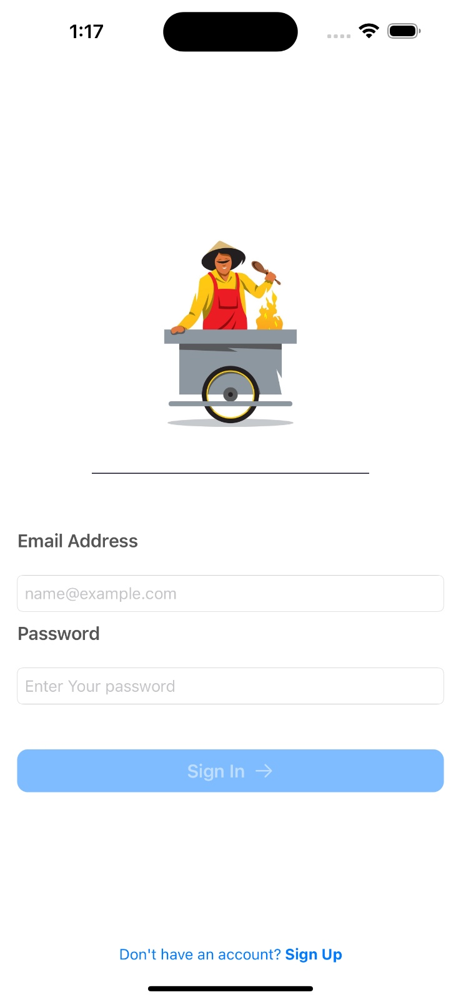
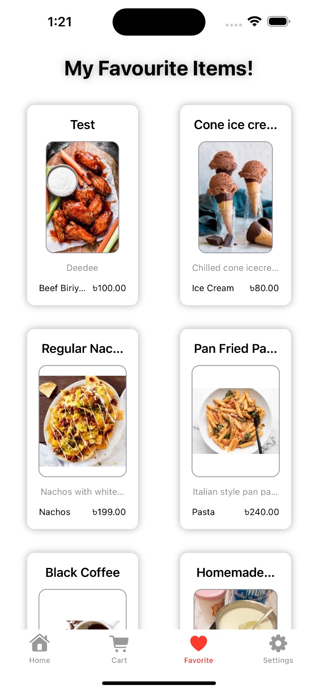
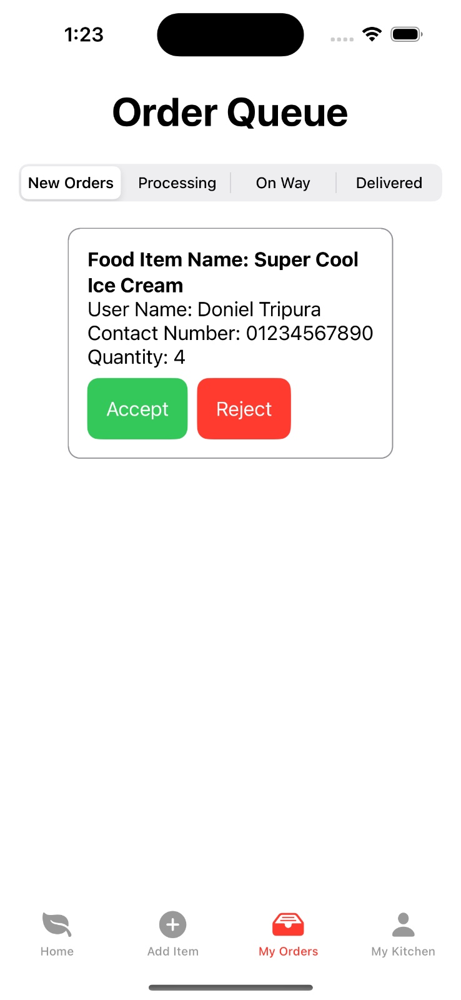

# Foodier

Welcome to **Foodier**, a dual-app Swift project designed to create an engaging food ordering experience for customers and restaurants alike.

## Apps Overview
Foodier consists of two separate apps:
- **Foodier!**: A seamless and personalized food ordering experience for customers.
- **Foodier! Restaurant**: A comprehensive restaurant management platform for handling orders, menus, and customer requests.

---

## Features Overview

### Foodier!
The **Foodier!** app enables customers to explore a variety of dishes and restaurants, with options to save favorites, manage orders, and customize their experience.

#### Key Screens
1. **Splash Screen**: Welcomes users with a vibrant introduction.
2. **Sign Up & Sign In**: Easy registration and login process.
3. **HomeView**: 
   - Explore available restaurants and items.
   - Search for items and filter by food type.
   - View item details and add items to favorites or cart.
   - Place orders directly from the app.
4. **Location Selection**: Customize orders based on location preferences.
5. **Cart**:
   - View and manage current orders.
   - Option to cancel orders.
6. **Favorites**: Access saved favorite items.
7. **Profile**:
   - Sign out or delete account.

#### Screenshots

<div align="center">
    
    
    
    
    <p><em>Figure 1: Splash Screen
</em></p>
</div>

<div align="center">
    
    
    
    <p><em>Figure 2: Sign In & Sign Up
</em></p>
</div>

<div align="center">
    
    
    
    
    
    
    <p><em>Figure 3: HomeView
</em></p>
</div>

<div align="center">
    
    
    
    
    <p><em>Figure 4: ItemView
</em></p>
</div>

<div align="center">
    
    
    
    
    <p><em>Figure 5: MyOrderView
</em></p>
</div>

<div align="center">
    
    <p><em>Figure 6: FavouriteView
</em></p>
</div>

<div align="center">
    
    <p><em>Figure 7: ProfileView
</em></p>
</div>

---

### Foodier! Restaurant
The **Foodier! Restaurant** app allows restaurant owners to manage orders, update menus, and oversee kitchen operations efficiently.

#### Key Screens
1. **Sign In & Sign Up**: Secure access to the restaurant management platform.
2. **HomeView**:
   - Display available restaurants and menu items.
   - Search for items, filter by food type, and view item details.
3. **Add ItemView**: Easily add new menu items.
4. **Order Queue View**:
   - Manage orders by status: New, Processing, On the Way, and Delivered.
5. **My Kitchen**:
   - View available items, update profiles, and log out.

#### Screenshots

<div align="center">
    
    
    
    <p><em>Figure 1: Sign In & Sign Up
</em></p>
</div>

<div align="center">
    
    
    
    
    <p><em>Figure 2: HomeView
</em></p>
</div>

<div align="center">
    
    
    
    <p><em>Figure 3: AddItemView
</em></p>
</div>

<div align="center">
    
    
    
    
    
    <p><em>Figure 4: MyOrderView
</em></p>
</div>


<div align="center">
    
    
    <p><em>Figure 5: MyKitchenView
</em></p>
</div>

<div align="center">
    
    <p><em>Figure 6: ProfileView
</em></p>
</div>


---

## Tech Stack

- **Language**: Swift
- **Platform**: iOS

---

## Installation

To get started with Foodier:

1. Clone the repository:
```bash
   git clone https://github.com/yourusername/foodier.git
```
2. Open the project in Xcode.
3. Build and run each app on the iOS simulator or a physical device.

## Contributions

Contributions are welcome! If you have suggestions for improving Foodier, please open an issue or submit a pull request.
## License

This project is licensed under the Apache License - see the [LICENSE](LICENSE) file for details.
## Contact

For any inquiries, please contact [donieltripura1971@gmail.com](donieltripura1971@gmail.com).